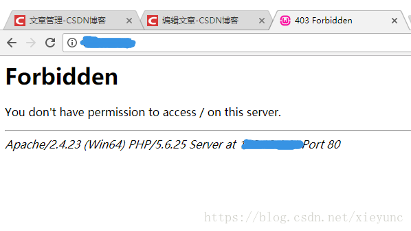

## 背景

WAMP 是 Windows Apache MySQL PHP 的简称，是 Windows 下最常用的 LAMP 工具，用户快速搭建开发环境。

默认情况下，WAMP 允许本地访问，但无法远程访问。


## 问题

如果网站配置完成后，通过外网 IP，或者局域网 IP 访问，会提示：




## 解决方法


需要分别修改两个文件，一个是 httpd.conf 文件，一个是 httpd-vhosts.conf 文件。


1. 打开 wamp 安装目录，打开 conf/httpd.conf 文件，找到下面一行：

```
<Directory "${INSTALL_DIR}/www/">
    AllowOverride none
    Require local
 </Directory>
```

修改为：

```
<Directory "${INSTALL_DIR}/www/">
    AllowOverride none
    Require all granted
 </Directory>
```

这意思是说，当访问 www 目录下的文件时，允许远程访问。

2. 打开 conf/extra 文件，找到 httpd-vhosts.conf 文件，同样将 Require local 修改为 Require all granted：


```diff
<VirtualHost *:80>
    ServerName localhost
    DocumentRoot c:/wamp64/www
    <Directory  "c:/wamp64/www/">
        Options +Indexes +Includes +FollowSymLinks +MultiViews
        AllowOverride All
-        Require local
+        Require all granted
    </Directory>
</VirtualHost>
```


3. 重启 WAMP 服务器
`

