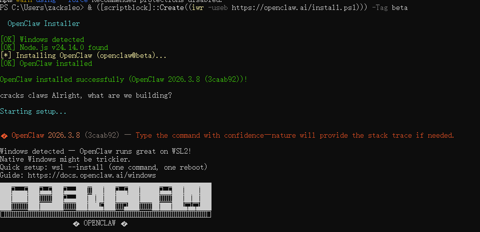

---
title: Windows安装OpenClaw教程
date: 2026-03-12 11:00:08
tags: [OpenClaw, 龙虾, AI]
---


## 原生安装方案

1. 安装依赖组件

### 安装 chocolatey

使用超级管理员权限打开 PowerShell, 运行以下命令安装 chocolatey

```Powershell
powershell -c "irm https://community.chocolatey.org/install.ps1|iex"
```

确认安装成功：

```Powershell
choco -v
```


### 使用 choco 安装 node （22+），git,  python 等

```Powershell
choco install git nodejs python
```


### 安装 Visual Studio


1. 打开 `C:\Program Files (x86)\Microsoft Visual Studio\Installer\vs_installer.exe`

2. 修改 Build Tools 2022

3. 勾选 Desktop development with C++ （桌面开发选项）


2. 使用 npm 安装 OpenClaw

```Powershell
npm i -g openclaw
```

##  WSL2 安装方案

### 找到 PowerShell ，以管理员身份运行

 


### 输入以下命令，允许脚本执行

```Powershell
Set-ExecutionPolicy -ExecutionPolicy RemoteSigned -Scope CurrentUser
```

### 输入以下命令，安装 OpenClaw：

```Powershell
& ([scriptblock]::Create((iwr -useb https://openclaw.ai/install.ps1))) -Tag beta
```


### 安装成功





## 运行 OpenClaw

输入以下命令，运行 OpenClaw：

```Powershell
openclaw onboard
···

## 常用命令

1. 打开 web 浏览器控制台

```Powershell
openclaw dashboard
```

2. 更新配置

```Powershell
openclaw config
```

3. 查看模型列表

```Powershell
openclaw models list
```

4. 查看技能列表

```Powershell
openclaw skills list
```

5. 打开命令行对话

```Powershell
openclaw tui
```

6. 查询消息频道列表

```Powershell
openclaw channels list
```

## 参考资料

- [OpenClaw](https://openclaw.ai/)
- [OpenClaw 中文社区](https://openclaws.io/zh/)