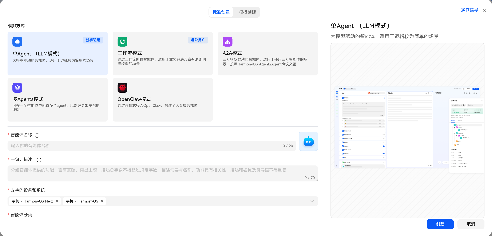
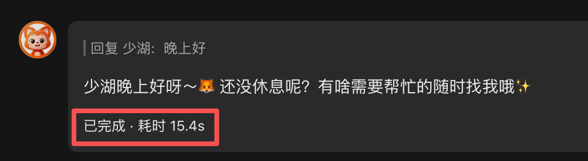
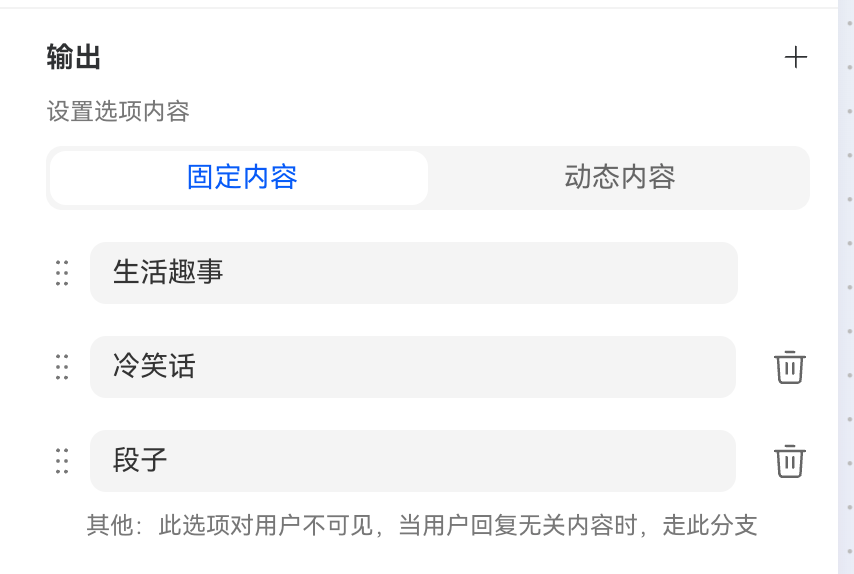
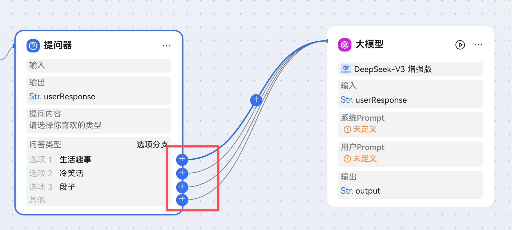

小艺智能体有五种编排方式，包括单Agent（也就是LLM 模式），工作流模式，A2A 模式，多 Agent 模式，以及 OpenClaw 模式。

1. 单Agent（也就是LLM 模式）
单Agent 模式是指在一个智能体中只有一个 Agent 来处理所有的任务和交互。这种模式适用于简单的应用场景，或者当任务的复杂度较低时，可以通过一个 Agent 来完成所有的工作。

> 单Agent （LLM模式）是一种基于大模型的智能体编排方式。开发者按需选择大模型，根据业务逻辑编写提示词，以 LLM 为理解中枢，结合意图识别、工具调用、对话上下文，动态选择插件、工作流，响应用户需求。 单Agent （LLM模式）适用于简单对话、知识问答、基础内容生成等场景。

2. 工作流模式

通过工作流编排智能体，适用于业务解决方案有清晰明确步骤的场景。

> 工作流模式是一种基于规则化流程的智能体编排方式。开发者将复杂任务拆解为有序的规则化步骤（如数据获取、处理、执行），串联插件、大模型、条件分支、代码块等组件实现自动化执行流程，完成业务逻辑。工作流模式适用于需多步骤协同、逻辑复杂、业务多样性的场景。

3. A2A 模式

当需要使用第三方的大模型的能力时，可以使用 A2A 模式。例如，当前小艺自带大模型不支持生成图片/视频能力，可能通过接入第三方大模型，如豆包，来实现生成图片/视频的能力。

> A2A模式是一种三方智能体接入小艺开放平台的高效编排方式。开发者可通过该模式基于鸿蒙Agent通信协议快速、便捷地将成熟的第三方智能体对接至小艺开放平台，实现分发与调用，提升平台的场景覆盖能力。该模式适用于同时具备鸿蒙端应用与云侧智能体能力的企业开发者。

4. 多 Agent 模式

可在一个智能体中配置多个 Agent，以处理更加复杂的逻辑。

5. OpenClaw 模式

通过该模式接入OpenClaw，构建个人专属智能体。

> OpenClaw 模式是一种开放灵活的智能体接入与构建方式，开发者可通过该模式接入OpenClaw工具 ，快速创建个性化智能体。该模式适用于个性化助手、自动化服务、场景化应用等多样化需求。

6. 端 A2A 模式

HarmonyOS应用内通过AgentAbility开发的智能体。

## 差异对照

<table>
<tr>
  <th colspan="2">能力</th>
  <th>单Agent（LLM模式）</th>
  <th>工作流模式</th>
  <th>A2A模式</th>
  <th>OpenClaw模式</th>
</tr>
<tr>
  <td rowspan="2">编排-模型选择</td>
  <td>模型选择&amp;模型设置</td>
  <td>√</td>
  <td>-</td>
  <td>-</td>
  <td>-</td>
</tr>
<tr>
  <td>对话设置</td>
  <td>-</td>
  <td>√</td>
  <td>-</td>
  <td>-</td>
</tr>
<tr>
  <td>编排-角色指令</td>
  <td>角色指令（prompt）</td>
  <td>√</td>
  <td>-</td>
  <td>-</td>
  <td>-</td>
</tr>
<tr>
  <td rowspan="18">编排-能力拓展</td>
  <td>A2A基础配置</td>
  <td>-</td>
  <td>-</td>
  <td>√</td>
  <td>-</td>
</tr>
<tr>
  <td>A2A输出设置</td>
  <td>-</td>
  <td>-</td>
  <td>√</td>
  <td>-</td>
</tr>
<tr>
  <td>OpenClaw基础配置</td>
  <td>-</td>
  <td>-</td>
  <td>-</td>
  <td>√</td>
</tr>
<tr>
  <td>开场对话&amp;预置问题</td>
  <td>√</td>
  <td>√</td>
  <td>√</td>
  <td>√</td>
</tr>
<tr>
  <td>输入文件设置</td>
  <td>√</td>
  <td>√</td>
  <td>√</td>
  <td>√</td>
</tr>
<tr>
  <td>用户问题建议</td>
  <td>√</td>
  <td>√</td>
  <td>-</td>
  <td>-</td>
</tr>
<tr>
  <td>快捷指令</td>
  <td>√</td>
  <td>√</td>
  <td>√</td>
  <td>-</td>
</tr>
<tr>
  <td>背景图片</td>
  <td>√</td>
  <td>√</td>
  <td>√</td>
  <td>√</td>
</tr>
<tr>
  <td>角色声音</td>
  <td>√</td>
  <td>√</td>
  <td>√</td>
  <td>√</td>
</tr>
<tr>
  <td>插件</td>
  <td>√</td>
  <td>-</td>
  <td>√</td>
  <td>-</td>
</tr>
<tr>
  <td>工作流/工作流配置</td>
  <td>√</td>
  <td>√</td>
  <td>-</td>
  <td>-</td>
</tr>
<tr>
  <td>触发器</td>
  <td>√</td>
  <td>√</td>
  <td>√</td>
  <td>-</td>
</tr>
<tr>
  <td>关联应用</td>
  <td>√</td>
  <td>√</td>
  <td>√</td>
  <td>-</td>
</tr>
<tr>
  <td>账号绑定设置</td>
  <td>-</td>
  <td>√</td>
  <td>√</td>
  <td>-</td>
</tr>
<tr>
  <td>付费智能体</td>
  <td>-</td>
  <td>√</td>
  <td>√</td>
  <td>-</td>
</tr>
<tr>
  <td>知识库</td>
  <td>√</td>
  <td>-</td>
  <td>-</td>
  <td>-</td>
</tr>
<tr>
  <td>变量</td>
  <td>√</td>
  <td>√</td>
  <td>√</td>
  <td>-</td>
</tr>
<tr>
  <td>长期记忆</td>
  <td>√</td>
  <td>√</td>
  <td>-</td>
  <td>-</td>
</tr>
<tr>
  <td rowspan="5">调试与预览</td>
  <td>真机测试</td>
  <td>√</td>
  <td>√</td>
  <td>√</td>
  <td>√</td>
</tr>
<tr>
  <td>触发器</td>
  <td>√</td>
  <td>-</td>
  <td>√</td>
  <td>-</td>
</tr>
<tr>
  <td>记忆</td>
  <td>√</td>
  <td>√</td>
  <td>-</td>
  <td>-</td>
</tr>
<tr>
  <td>朗读</td>
  <td>√</td>
  <td>√</td>
  <td>√</td>
  <td>√</td>
</tr>
<tr>
  <td>调试</td>
  <td>√</td>
  <td>√</td>
  <td>√</td>
  <td>√</td>
</tr>
</table>s