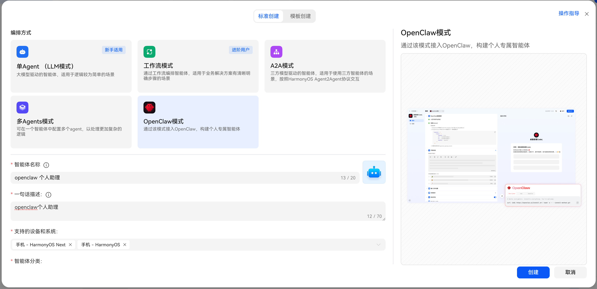
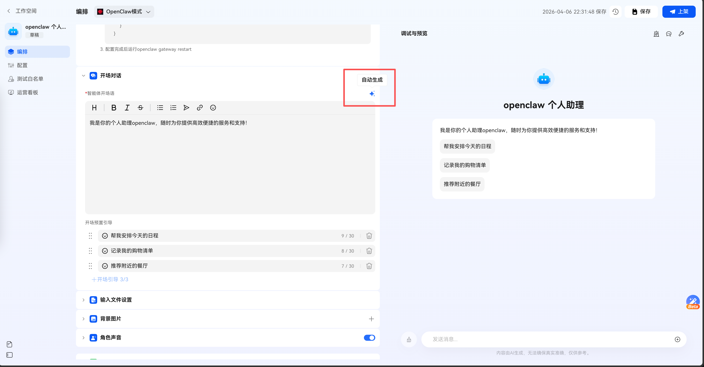

## 原理

在这种模式式，小艺相当于是一个 IM，类似 QQ/飞书/钉钉。用户输入的内容会被发送到 openclaw，openclaw会根据用户输入和智能体的配置进行处理，并将结果返回给小艺，小艺再将结果展示给用户。

## 前置条件

首先需要在电脑或者云主机上安装好 openclaw

## 创建智能体



## 配置 Channel

1. 在openclaw机器执行openclaw plugins install @ynhcj/xiaoyi@latest
2. 在openclaw.json中的channels配置小艺，具体配置如下：

```json
"channels": {
    "xiaoyi": {
        "enabled": true,
        "ak": "小艺开放平台凭证ak",
        "sk": "小艺开放平台凭证sk",
        "agentId": "xxx"
      }
  }
```

3.配置完成后运行 openclaw gateway restart


## 开场对话

