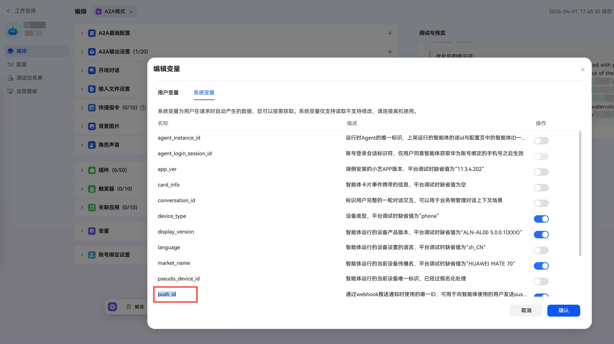

## 背景

当智能体运行较长时间的任务时，用户可能短暂离开智能体，当任务执行成功后，可以通过消息推送的方式，告知用户任务执行成功。

## 配置

首先我们需要在智能体编排中的变量中，添加 push_id

## 参考资料

- [PUSH通知](https://developer.huawei.com/consumer/cn/doc/service/pushmessage-0000002505761436)
- [Webhook事件](https://developer.huawei.com/consumer/cn/doc/service/trigger-webhook-0000002525203283)