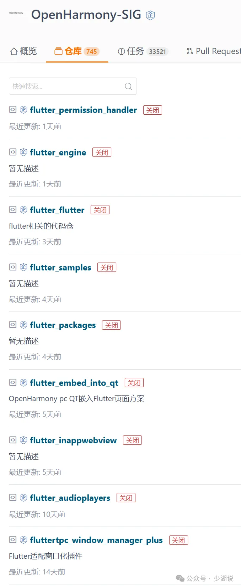

2月24日，gitee 上的开源鸿蒙组织，所有代码停止更新，查看代码仓显示已关闭，不少小伙伴以为停止更新了，发生了什么？



原因很简单，所有代码仓迁移至 [Gitcode](https://gitcode.com/)，至于为什么改用 Gitcode，从其[官方帮助文档](https://docs.gitcode.com/docs/start/)可以得到答案。

> GitCode 是一款由 CSDN 开发者社区与华为云 CodeArts 联合打造的新一代开源代码托管平台。 作为开发者的全能助手，GitCode 集代码托管、协同研发、项目管理与开源运营支持于一体，为个人开发者、团队和企业提供高效、安全、智能的解决方案。 高效协作：分支管理、代码审查、超级仓支持，让开发更流畅。 自动化流程：内置 CI/CD 功能，自动化构建、测试和部署，缩短产品交付周期。

自家产品，当然优先选择。笔者也第一时间试用了 Gitcode，界面清爽，总体感觉还不错。

下面进入正文，讨论现有环境、工程、代码如何调整。只要是涉及 git 仓库的地址需要调整，只需要修改域名即可，例如原来仓库为

`https://gitee.com/openharmony-sig/flutter_flutter`

改为 `https://gitcode.com/openharmony-sig/flutter_flutter`。

## 鸿蒙Flutter实战

为了更方便开发者使用，系列仓库也同步至 gitcode

### Flutter鸿蒙适配指南

Gitee: `https://gitee.com/zacks/awesome-harmonyos-flutter`

GitCode: `https://gitcode.com/zacksleo/awesome-harmonyos-flutter`

### Flutter鸿蒙版Demo

Gitee: `https://gitee.com/zacks/flutter-ohos-demo`

GitCode: `https://gitcode.com/zacksleo/flutter-ohos-demo`

### 鸿蒙原生应用demo

Gitee: `https://gitee.com/zacks/arkts-ohos-demo`

GitCode: `https://gitcode.com/zacksleo/arkts-ohos-demo`

## 环境

### 1. Flutter 3.22

如果你使用的是3.22 的鸿蒙sdk，暂时不需要调整，仍然使用，`https://gitee.com/harmonycommando_flutter/flutter`

### 2. Flutter 3.7

如果你使用的是3.7的鸿蒙sdk，需要修改 sdk 的 git 地址, 进入鸿蒙 flutter sdk 的目录，修改其 remote 仓库地址：

```bash
vim .git/config
```

修改 gitee.com 域名为 gitcode.com

修改后的内容像这样：

```bash
[core]
	repositoryformatversion = 0
	filemode = true
	bare = false
	logallrefupdates = true
	ignorecase = true
	precomposeunicode = true
[remote "origin"]
	url = https://gitcode.com/openharmony-sig/flutter_flutter.git
	fetch = +refs/heads/*:refs/remotes/origin/*
[branch "dev"]
	remote = origin
	merge = refs/heads/dev
	vscode-merge-base = origin/master
```

## 其他仓库

flutter engine: `https://gitcode.com/openharmony-sig/flutter_engine`

flutter packages: `https://gitcode.com/openharmony-sig/flutter_packages`

flutter samples: `https://gitcode.com/openharmony-sig/flutter_samples`

插件，同步修改域名，如 flutter inappwebview

`https://gitcode.com/openharmony-sig/flutter_inappwebview`

修改完重新执行 `pub get`