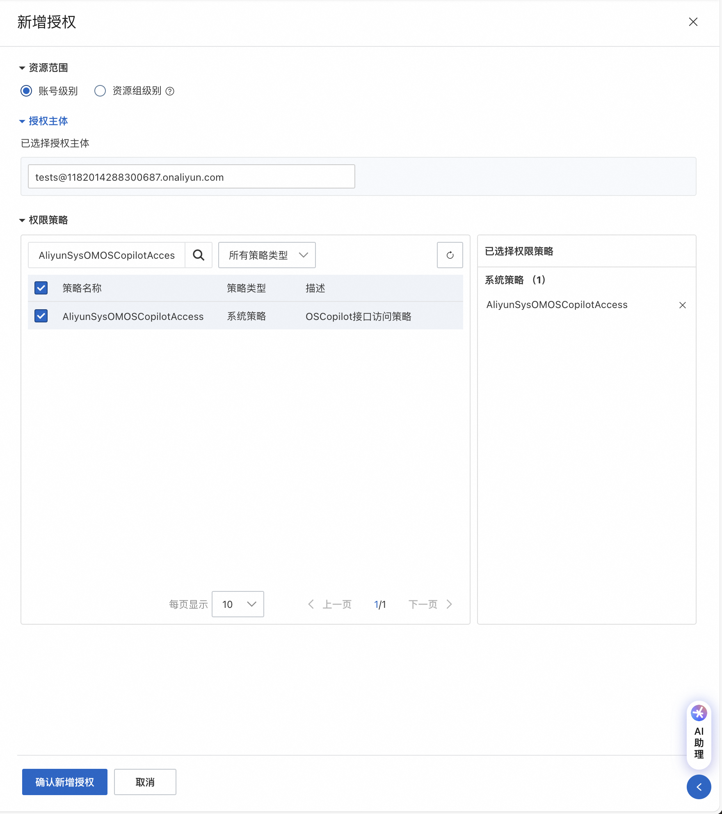

## 安装

1. 开通 ECS 服务器

服务器镜像，建议选择 Alibaba Cloud Linux、CentOS、Ubuntu 或 Anolis OS

2. 安装 os-copilot

如果是 Alibaba Cloud Linux/CentOS，执行以下命令安装 os-copilot：

```bash
sudo yum install -y os-copilot
```

如果是 Ubuntu：

`curl -#S https://mirrors.aliyun.com/os-copilot/os-copilot-all-in-one-latest.sh | bash`

## 配置

### 1.配置 RAM 用户

由于需要使用 AK，SK， 这里先添加 RAM 用户

打开 https://ram.console.aliyun.com/users，点击创建用户，填写登录名称，访问方式勾选 `使用永久 AccessKey 访问`，点击确定。

复制 AccessKey，AccessSecret，后面会用到。


### 2.分配权限

点击用户名称，在标签栏处，点击权限管理，`新增授权`，在权限策略处，搜索 “AliyunSysOMOSCopilotAccess”，然后勾选，点击 “确认新增授权”




这样，RAM 用户就拥有了 os-copilot 的权限。

### 3.在命令行中配置 AK，SK

让我们回到服务器的命令行，执行以下命令：

```bash
export ALIBABA_CLOUD_ACCESS_KEY_ID=<AccessKey ID>
export ALIBABA_CLOUD_ACCESS_KEY_SECRET=<AccessKey Secret>
```

将 <AccessKey ID> 和 <AccessKey Secret> 替换为上面您自己复制的 AccessKey。

## 测试

### 1.使用普通模式

```bash
copilot 当前服务器的健康度
```

输出以下内容
```bash
[root@moguyun ~]# copilot 当前服务器的健康度

[Copilot]:
要检查当前服务器的健康度，可以执行以下几个步骤来获取相关信息：
 1 检查CPU使用率： 使用 top 命令可以查看当前系统的CPU使用情况。
    top -b -n 1
 2 检查内存使用情况： 使用 free 命令可以查看内存使用情况。
    free -h
 3 检查磁盘使用情况： 使用 df 命令可以查看磁盘空间使用情况。
    df -h
 4 检查网络连接状态： 使用 netstat 命令可以查看网络连接状态。
    netstat -tuln
 5 检查系统负载： 使用 uptime 命令可以查看系统的平均负载。
    uptime
 6 检查系统日志： 使用 journalctl 命令可以查看系统日志，帮助发现潜在的问题。
    journalctl -xe
 7 检查服务状态： 使用 systemctl 命令可以查看系统服务的状态。
    systemctl list-units --type=service --state=failed

通过以上命令，你可以全面了解服务器的健康状况。如果有任何异常，可以根据输出的信息进一步排查问题。

[Copilot]发现如下命令:
    1. top -b -n 1
    2. free -h
    3. df -h
    4. netstat -tuln
    5. uptime
    6. journalctl -xe
    7. systemctl list-units --type=service --state=failed

[Copilot]: 请选择要执行的命令或者保存所有命令，从[s, 1, 7]中进行选择，回复's'或'save'进行保存，回复'n'或'no'进行取消，回复'r'或'retry'重新生成回答。
请输入: 1

[Copilot]: 确认执行该命令[top -b -n 1]？(y/n)
请输入: y
top - 15:53:04 up 94 days, 22:14,  1 user,  load average: 0.01, 0.02, 0.00
Tasks: 224 total,   1 running, 220 sleeping,   0 stopped,   3 zombie
%Cpu(s):  3.1 us,  3.1 sy,  0.0 ni, 93.8 id,  0.0 wa,  0.0 hi,  0.0 si,  0.0 st
MiB Mem :   3581.4 total,    668.4 free,   1285.0 used,   1628.1 buff/cache
MiB Swap:      0.0 total,      0.0 free,      0.0 used.   1834.3 avail Mem

    PID USER      PR  NI    VIRT    RES    SHR S  %CPU  %MEM     TIME+ COMMAND
3216368 root      20   0       0      0      0 I   6.7   0.0   0:01.06 kworker+
      1 root      20   0  169548   6352   3068 S   0.0   0.2   1:40.93 systemd
      4 root       0 -20       0      0      0 I   0.0   0.0   0:00.00 rcu_par+

...

3219422 root      20   0    2744    816    708 S   0.0   0.0   0:00.23 copilot
3219423 root      20   0  517300  73980  17776 S   0.0   2.0   0:01.34 copilot
3219447 root      20   0  227204   4668   4020 R   0.0   0.1   0:00.00 top

[Copilot]: 执行结束。
```

可以看到，这种模式下，Copilot 会根据用户的输入要求，给出对应的建议命令，然后需要手动选择、确认执行。

### 2.使用自动模式，在命令后面增加参数 `-t`

```bash
copilot 当前服务器的健康度 -t
```

输出以下内容

```bash
[Copilot]:
为了评估服务器的健康状况，我们需要检查一些关键指标，比如CPU使用率、内存使用情况、磁盘空间和网络状态。这些信息可以通过执行一系列的命令来获取。

[Copilot]:
从top命令的输出可以看到，CPU的使用率大约为6.2%（用户进程3.1% + 系统进程3.1%），空闲率为93.8%，这表明CPU的负载较低。

[Copilot]:
从free -m命令的输出可以看到，总内存为3581MB，已使用的内存为1284MB，空闲内存为669MB，缓冲/缓存占用1627MB，可用内存为1834MB。这表明内存使用情况良好，没有出现内存不足的情况。

接下来，我们检查磁盘空间和网络状态。

[Copilot]:
从df -h命令的输出可以看到，根文件系统的总大小为79GB，已使用36GB，剩余40GB，使用率为48%。这表明磁盘空间还有足够的余量，没有出现磁盘空间不足的情况。

最后，我们检查网络状态。

[Copilot]:
从netstat -tuln命令的输出可以看到，服务器上运行着多个监听端口的服务，包括HTTP (80), HTTPS (443), SSH (22)等常用服务。这些服务都在正常监听状态，没有异常。

综合以上信息：

 • CPU使用率较低，约为6.2%。
 • 内存使用情况良好，没有出现内存不足的情况。
 • 磁盘空间还有足够的余量，使用率为48%。
 • 网络状态正常，各服务都在正常监听状态。

因此，当前服务器的健康状况良好，没有明显的性能瓶颈或资源不足的问题。

[Copilot]:
当前服务器的健康状况良好，没有明显的性能瓶颈或资源不足的问题。具体指标如下：

 • CPU使用率：约6.2%
 • 内存使用情况：总内存3581MB，已使用1284MB，空闲669MB，缓冲/缓存1627MB，可用1834MB
 • 磁盘空间：根文件系统总大小79GB，已使用36GB，剩余40GB，使用率48%
 • 网络状态：各服务都在正常监听状态，没有异常
```

### 3.使用文件定义任务

新建一个文件，定义需要执行的任务

```
cat task.txt

1.查找日志中大于200M的文件，列出来，显示每个文件的名称和大小
2.用户确认是否清理
3.确认以后删除这些文件
```

测试结果

copilot 执行任务

```bash
co -f ~/task.txt -t
```

```
[Copilot]:
我需要先找到大于200M的日志文件并列出它们的名称和大小。这可以通过find命令实现。

[Copilot]:
Observation:
```

### 4.测试解释命令

```bash
cat /etc/sysctl.conf |co "使用中文解释"

[Copilot]:
这些配置项都是用于调整Linux内核参数的，下面我将逐一解释每个配置项的意义：                                                                                                        vm.swappiness = 0
 • 含义：vm.swappiness 参数控制了系统使用交换空间（swap）的倾向性。值为0表示尽可能避免使用交换空间，只有当物理内存不足时才会使用。
 • 作用：减少磁盘I/O操作，提高系统性能。                                                                                                                            kernel.sysrq = 1

 • 含义：kernel.sysrq 参数启用了“魔术 SysRq”键功能。当设置为1时，允许通过组合键（通常是 Alt + SysRq + <command>）执行某些低级别的内核操作。
 • 作用：在系统出现严重问题时，可以用来诊断和恢复系统。                                                                                                        net.ipv4.neigh.default.gc_stale_time = 120

 • 含义：net.ipv4.neigh.default.gc_stale_time 参数设置了邻居表项（如ARP缓存）中过期条目的垃圾回收时间。值为120秒表示过期条目将在120秒后被清理。
 • 作用：防止邻居表项占用过多内存，保持网络连接的高效性。                                                                                                                   net.ipv4.conf.all.rp_filter = 0

...

 • 注释：net.ipv4.tcp_max_syn_backlog 参数设置了SYN队列的最大长度。值为65536表示最多允许65536个未完成的连接请求。
 • 作用：增加SYN队列长度，提高服务器处理大量并发连接的能力。
 • 注意：此参数仅在 net.ipv4.tcp_syncookies 设置为0时生效。

这些配置项通常用于优化系统的网络性能和安全性，确保在高负载情况下系统的稳定性和响应速度。
```


## 参考资料

[智能助手OS Copilot使用说明](https://help.aliyun.com/zh/alinux/user-guide/instructions-for-os-copilot)
